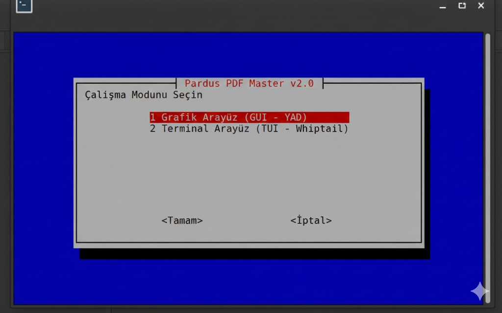
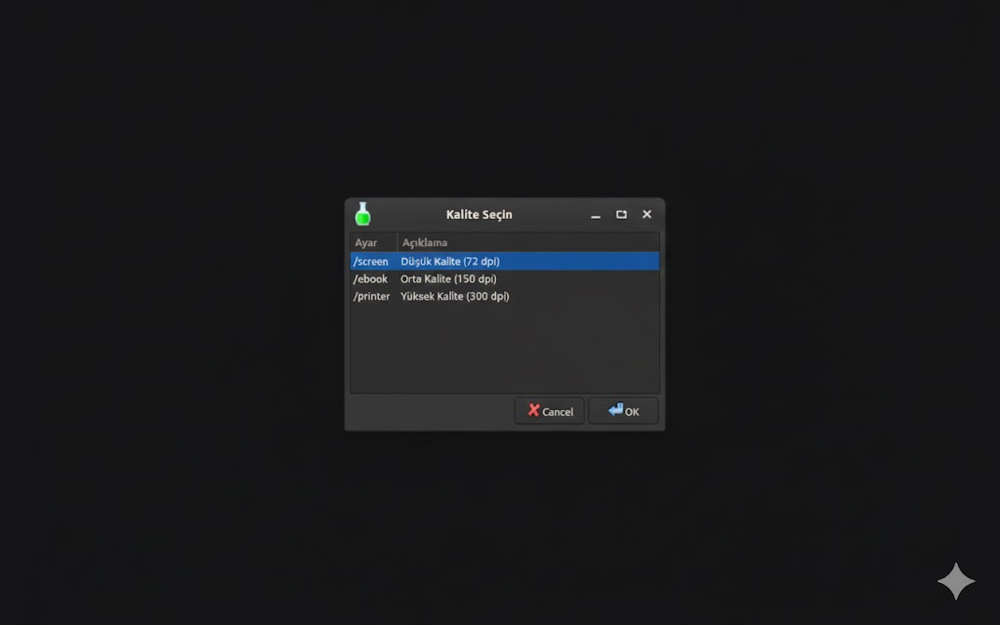

# Pardus Gelişmiş PDF Optimizasyon ve Sıkıştırma Aracı(Ghostscript)
## Proje Tanıtımı ve Amacı
Bu proje, Linux sistemlerde (özellikle Pardus) Ghostscript motorunu kullanarak PDF dosyalarını optimize etmek, boyutlarını küçültmek ve kullanım amacına göre (ekran, e-kitap, baskı) kalite seviyelerini ayarlamak için geliştirilmiş kullanıcı dostu bir araçtır.

Uygulama, terminal karmaşasını ortadan kaldırarak hem Grafik Kullanıcı Arayüzü (GUI) hem de Terminal Kullanıcı Arayüzü (TUI) üzerinden profesyonel PDF işleme imkanı sunar.
## Öne Çıkan Özellikler
Dinamik Kalite Seçimi: Kullanım amacına göre 3 farklı sıkıştırma seviyesi (/screen, /ebook, /printer).

İstatistik Raporlama: İşlem sonunda orijinal boyut ve yeni boyut farkını anlık olarak ekranda gösterme.

Güvenli İşlem (Otomatik Yedekleme): Orijinal dosyayı korumak için işlem öncesi otomatik .bak yedeği oluşturma.

İşlem Günlüğü (Loglama): Yapılan tüm işlemlerin tarih, saat ve parametre bilgilerini pdf_islem_gecmisi.log dosyasına kaydetme.

Hata Kontrolü: Eksik bağımlılıkları ve hatalı dosya yollarını denetleyen akıllı mekanizma.

## Kurulum Talimatları ve Bağımlılıklar
Uygulamanın Pardus üzerinde sorunsuz çalışabilmesi için aşağıdaki paketlerin sisteminizde yüklü olması gerekmektedir:
### Sistem Gereksinimleri
Ghostscript: PDF işleme motoru.

YAD (Yet Another Dialog): Grafiksel arayüz bileşenleri için.

Whiptail: Terminal tabanlı (TUI) arayüz bileşenleri için.
### Kurulum Komutu
Terminali açarak aşağıdaki komutu uygulayınız:
```
sudo apt update && sudo apt install ghostscript yad whiptail -y
```
### Kullanım Kılavuzu
Uygulamayı çalıştırmak için script dosyasına yetki verip başlatmanız yeterlidir:
Script'i Çalıştırılabilir Yapın:

 ```
 chmod +x pdf_araci.sh
  ```

Uygulamayı Başlatın:

```
./pdf_araci.sh
```
### Kullanım Senaryoları:
GUI Modu: Dosya yöneticisi üzerinden görsel seçim yapmak isteyen kullanıcılar için idealdir.YAD arayüzü ile dosya yöneticisinden seçim yapmanızı sağlar.

TUI Modu: Daha düşük kaynak tüketen, klavye odaklı hızlı işlemler için tasarlanmıştır. Whiptail üzerinden metin tabanlı yönlendirmelerle çalışır.

### Uygulama Ekran Görüntüleri:





### Tanıtım Videosu:
Projenin özelliklerini, kod yapısını ve canlı demosunu içeren sesli anlatım videosuna aşağıdan ulaşabilirsiniz:

### Proje Geliştiricisi:

    İsim Soyisim: [Erva Nur Bostancı]

    Proje Konusu: Pardus PDF Sıkıştırma ve Optimizasyon Paneli
